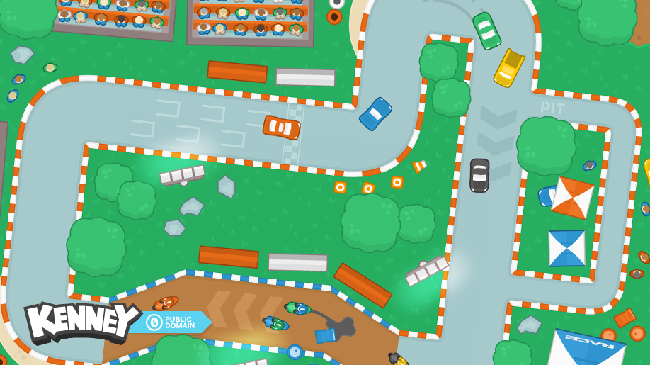
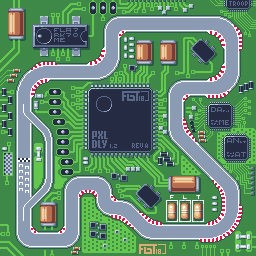
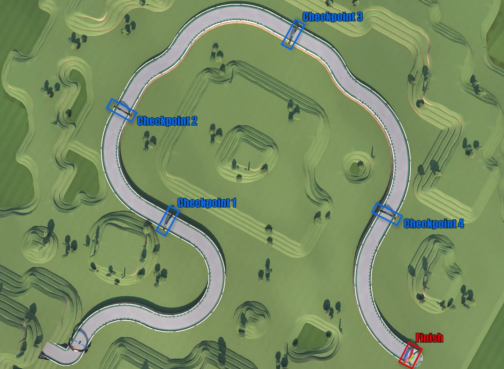

# Startdocument for C# Periode 4 Year 2

-   Startdocument of **Daan Daling**. Studentnumber **4815580**.
-   Startdocument of **Kevin Smulders**. Studentnumber **4806131**.
-   Startdocument of **Roan Meijer**. Studentnumber **4872584**.
-   Startdocument of **Simchaja Schonewille**. Studentnumber **4733312**.

### Problem Discription

Voor het project moet een game worden gemaakt, hierbij is gekozen voor een top-down racer game. Deze game is 2d
en hierin moet een speler zo snel mogelijk een circuit te voltooien. De besturing zal worden uitgevoerd met de W A S D toetsen,
ook hebben de spelers acceleratie en deceleratie zodat de spelers niet gelijk van 0 naar 100 kunnen gaan of 100 naar 0.
In dit spel moet een AI doormiddel van machine learning leren om een rondje in het spel af te leggen. Hierin moet de AI
met behulp van verschillende generaties zichzelf verbeteren om een zo snel mogelijke map tijd af te leggen. Ook moet het
hierna voor een speler mogelijk zijn om een map tegen de AI af te leggen.

-   Maak een top down racer game
-   Maak de controls voor de racer game
-   Maak het visuele aspect van de game
-   Pas toe dat de spelers kunnen accelereren deceleren
-   Pas machine learning toe met de gebruik van een neural network
-   Geef de input van de AI weer
-   Geef de score van een map weer
-   Geef een timer weer
-   Maak het mogelijk om met meerdere instanties van de AI te trainen
-   Pas incentive learning toe (checkpoints, reward systeem etc.)
-   Maak het mogelijk tegen de AI te spelen

### Examples

## First example

## Second example

## Third example

### Input & Output

in de volgende sectie wordt de input en output van de applicatie beschreven

#### Input

| Case         | Type | Conditions |
| ------------ | ---- | ---------- |
| KeyDown("w") | Key  | in game    |
| KeyDown("a") | Key  | in game    |
| KeyDown("s") | Key  | in game    |
| KeyDown("d") | Key  | in game    |

#### Output

| Case                    | Type           |
| ----------------------- | -------------- |
| actions preformed by AI | keys           |
| scores                  | integer        |
| best preforming AI      | neural network |
| timer                   | int            |
| current generation      | neural network |

#### Remarks

-   VOORBEELD Input wordt gevalideerd
-   VOORBEELD alleen de main bevat XXXX
-   VOORBEELD wordt getest

## Class Diagram

## MosCow Analyse

## Testplan

De testcases die worden gebruikt om de applicatie te testen

### Testcases voor de schermen

Dit is het testplan voor de verschilende schermen die in beeld komen.

#### Testcase #1, Bij het opstarten van de aplicatie zie je een startmenu

Hieronder staat een afbeelding met een voorbeeld van hoe dit scherm er uit moet komen te zien.

#### Testcase #2, Bij het winnen van een ronde zie je een scherm met de score van de ronde

Hieronder staat een afbeelding met een voorbeeld van hoe dit scherm er uit moet komen te zien.

#### Testcase #3, Bij het verliezen van een ronde zie je een scherm met de score van de ronde

Hieronder staat een afbeelding met een voorbeeld van hoe dit scherm er uit moet komen te zien.

#### Testcase #4, Een menu voor de aanpassing van de AI

Hieronder staat een afbeelding met een voorbeeld van hoe dit scherm er uit moet komen te zien.

#### Testcase #5, Een menu voor het opstarten van een nieuwe ronde

Hieronder staat een schematiese afbeelding met een voorbeeld van hoe dit scherm er uit moet komen te zien. en wat voor opties in het scherm komen te staan.

### Testplan Game

Dit is het testplan om de game te testen

#### Testcases #1, Auto raakt muur en gaat dood

| Step | Input | Expected output |
| ---- | ----- | --------------- |
|      |       |                 |

#### Testcases #2, Auto raakt checkpoint

| Step | Input | Expected output |
| ---- | ----- | --------------- |
|      |       |                 |

#### Testcases #3, Score gaat omhoog

| Step | Input | Expected output |
| ---- | ----- | --------------- |
|      |       |                 |

#### Testcases #4, Score gaat omlaag

| Step | Input | Expected output |
| ---- | ----- | --------------- |
|      |       |                 |

#### Testcases #5, Auto kan worden bewogen door de speler

| Step | Input | Expected output |
| ---- | ----- | --------------- |
|      |       |                 |

### Testplan Ai

Dit is het testplan om de AI te testen

#### Testcases #1, De Ai kan de auto bewegen

Dit kan getest worden door te zien dat de auto beweegt

#### Testcases #2, Achteruit rijden over de finish is niet een optie.

Als de baan een rondjes is gaat de ai niet achteruit rijden om over de finish te rijden
De ai kan niet achteruit rijden om over de finish te rijden en dan krijgt hij daar geen punten voor.

#### Testcases #3, Het is mogelijk om meerdere generaties te gelijk te trainen

Bij het trainen van de AI kan je meerdere generaties trainen.

#### Testcases #4, De nieuwe generatie word gekozen op basis van het reward systeem

Op basis van de rating van het reward system word de nieuwe generatie voor de AI gekozen.

#### Testcases #5, Er kan een nieuwe ronden worden gestart

Als alle versies van de ai dood zijn word een nieuwe ronden gestart.
