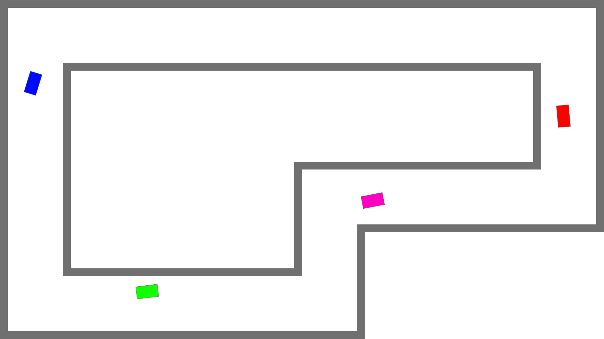
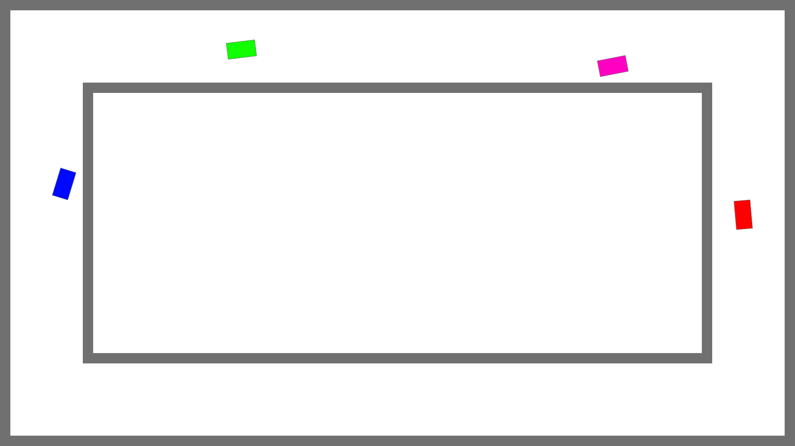

# Startdocument for C# Periode 4 Year 2

-   Startdocument of **Daan Daling**. Studentnumber **4815580**.
-   Startdocument of **Kevin Smulders**. Studentnumber **4806131**.
-   Startdocument of **Roan Meijer**. Studentnumber **4872584**.
-   Startdocument of **Simchaja Schonewille**. Studentnumber **4733312**.

### Problem Discription

Voor het project moet een game worden gemaakt, hierbij is gekozen voor een top-down racer game. Deze game is 2d
en hierin moet een speler zo snel mogelijk een circuit te voltooien. De besturing zal worden uitgevoerd met de W A S D toetsen,
ook hebben de spelers acceleratie en deceleratie zodat de spelers niet gelijk van 0 naar 100 kunnen gaan of 100 naar 0.
In dit spel moet een AI doormiddel van machine learning leren om een rondje in het spel af te leggen. Hierin moet de AI
met behulp van verschillende generaties zichzelf verbeteren om een zo snel mogelijke map tijd af te leggen. Ook moet het
hierna voor een speler mogelijk zijn om een map tegen de AI af te leggen.

-   Maak een top down racer game
-   Maak de controls voor de racer game
-   Maak het visuele aspect van de game
-   Pas toe dat de spelers kunnen accelereren deceleren
-   Pas machine learning toe met de gebruik van een neural network
-   Geef de input van de AI weer
-   Geef de score van een track weer
-   Geef een timer weer
-   Maak het mogelijk om met meerdere instanties van de AI te trainen
-   Pas incentive learning toe (checkpoints, reward systeem etc.)
-   Maak het mogelijk tegen de AI te spelen

### Examples

## Eerste voorbeeld van een soortgelijk spel

## UI-Schetsen van de game

### Input & Output

in de volgende sectie wordt de input en output van de applicatie beschreven

#### Input

| Case                  | Type           | Conditions |
| --------------------- | -------------- | ---------- |
| KeyDown("w")          | Key            | in game    |
| KeyDown("a")          | Key            | in game    |
| KeyDown("s")          | Key            | in game    |
| KeyDown("d")          | Key            | in game    |
| Import neural network | Neural network | in menu    |

#### Output

| Case                    | Type           |
| ----------------------- | -------------- |
| actions preformed by AI | keys           |
| scores                  | integer        |
| best preforming AI      | neural network |
| timer                   | int            |
| current generation      | neural network |

## MosCow Analyse

| Must Have                           | Should Have                                                | Could Have                            | Won't Have              |
| ----------------------------------- | ---------------------------------------------------------- | ------------------------------------- | ----------------------- |
| Een top down racer game             | Een mooie/gepolijste weergave van het spel                 | Mogelijkheid om tegen de AI te spelen | Een online speelfunctie |
| Controls om de game te spelen       | Export & import neural network                             | Optie om het thema te veranderen      | Tracking camera         |
| Een 2D weergave van het spel        | Weergave van de keuzes/input van de AI                     | Optie om de auto te laten driften     | Collisions between cars |
| Een toepassing van machine learning | Weergave van een score in het spel                         | Scoreboard met highscores             |                         |
| Toepassing van Incentive learning   | Weergave van de track time in het spel                     | Animaties van de auto                 |                         |
|                                     | Mogelijkheid om meerdere generaties AI tegelijk te trainen | Pauzemenu                             |                         |
|                                     | Achtergrond muziek                                         |                                       |                         |
|                                     | Acceleratie en deceleratie                                 |                                       |                         |

## Testplan

De testcases die worden gebruikt om de applicatie te testen

### Testcases voor de schermen

Dit is het testplan voor de verschilende schermen die in beeld komen.

#### Testcase #1, Bij het opstarten van de aplicatie zie je een startmenu

Bij dit start menu kan je 2 verschillende game modes selecteren.

#### Testcase #2, Je hebt een keuze menu voor de baan waarop je wil racen

Als je een game mode hebt gekozen kan je een bepaalde baan selecteren om daar op te racen.

#### Testcase #3, Extra spelers toevoegen

Als je een multiplayer game start krijg je een optie om het aantal spelers toe te voegen tot maximaal 4 spelers

#### Testcase #4, Een menu voor de aanpassing van de AI

Hieronder staat een afbeelding met een voorbeeld van hoe dit scherm er uit moet komen te zien. Voor de ai starten alle spelers op de zelfde positie.

#### Testcase #5, De game

Als een game wordt gestart wordt de baan ingeladen en worden het aantal spelers weer gegeven. Er kan dan meteen worden geraced.

### Testplan Game

Dit is het testplan om de game te testen

#### Testcases #1, Auto raakt muur en gaat dood

Op het moment dat de auto een muur raakt gaat die speler dood en krijgt hij een game overscherm.

#### Testcases #2, De finishline kan alleen behaald worden als hij alle voorgaande checkpoints heeft behaald.

Als een baan 3 checkpoints heeft kan de speler gewoon door de finishline rijden zonder dat hij daadwerkelijk finished.

#### Testcases #3, De timer

Op het moment dat de race start start er een timer die blijft lopen tot dat alle autos dood zijn.

#### Testcases #4, Ingame score board

De socre is zichtbaar in beeld en gaat omhoog en omloog op basis van de auto waarmee je speelt.

#### Testcases #5, Auto kan worden bewogen door de speler

De auto kan 4 richtingen op bewogen worden.
Bijvoorbeeld:
A = draaien naar links
S = achteruit
D = draaien naar rechts
W = Vooruit
De input verschilt per speler

### Testplan Ai

Dit is het testplan om de AI te testen

#### Testcases #1, De Ai kan de auto bewegen

Dit kan getest worden door te zien dat de auto beweegt

#### Testcases #2, Achteruit rijden over de finish is niet een optie.

Als de baan een rondjes is gaat de ai niet achteruit rijden om over de finish te rijden
De ai kan niet achteruit rijden om over de finish te rijden en dan krijgt hij daar geen punten voor.

#### Testcases #3, Het is mogelijk om meerdere generaties te gelijk te trainen

Bij het trainen van de AI kan je meerdere generaties trainen.

#### Testcases #4, De nieuwe generatie word gekozen op basis van het reward systeem

Op basis van de rating van het reward system word de nieuwe generatie voor de AI gekozen.

#### Testcases #5, Er kan een nieuwe ronden worden gestart

Als alle versies van de ai dood zijn word een nieuwe ronden gestart.
